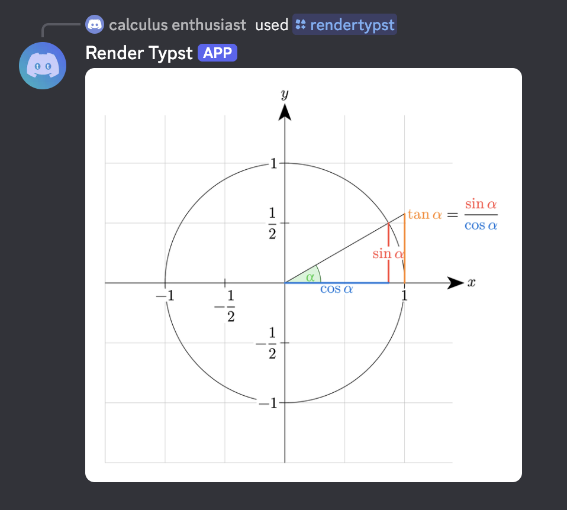

<p align="center">
  
</p>

# Typst Render (Discord Bot)

A Discord bot that renders [typst](https://typst.app/) markup. [Add it to your account](https://discord.com/oauth2/authorize?client_id=1521969158416236674).

## Usage

The bot registers two commands: a slash command (`/rendertypst`), and a context menu command. The slash command opens a modal for you to type/paste your typst code, while the context menu command (used by right-clicking a message) can render code sent in someone else's message.

## Packages

Any [Typst Universe](https://typst.app/universe) package can be imported:

```typst
#import "@preview/cetz:0.5.2": canvas, draw
```

Featured packages/templates are vendored into `packages/`, and served without network use. Everything else is downloaded from the registry during render-time, into memory only.

Run `scripts/vendor-packages.sh` after a fresh checkout. Set `TYPST_PACKAGES_DIR` if the bot runs somewhere other than the repo root.

## Examples

Displaying some math equations:


Creating a diagram using the [CeTZ](https://typst.app/universe/package/cetz/) library:


The page is automatically sized to fit your content.

<details>
<summary>Sandboxing details</summary>

The bot renders arbitrary code from non-trusted users, so each compilation job is isolated. To accomplish this, the bot has the following:

- **Separate process per render**
- **Memory cap**: each process is limited to 1GB of memory.
- **Timeout**: compiles are killed after 2 minutes.
- **No filesystem**: neither package/file resolver exposes the filesystem to user code.
- **Concurrency limit**: at most 5 renders can run at the same time.

</details>
