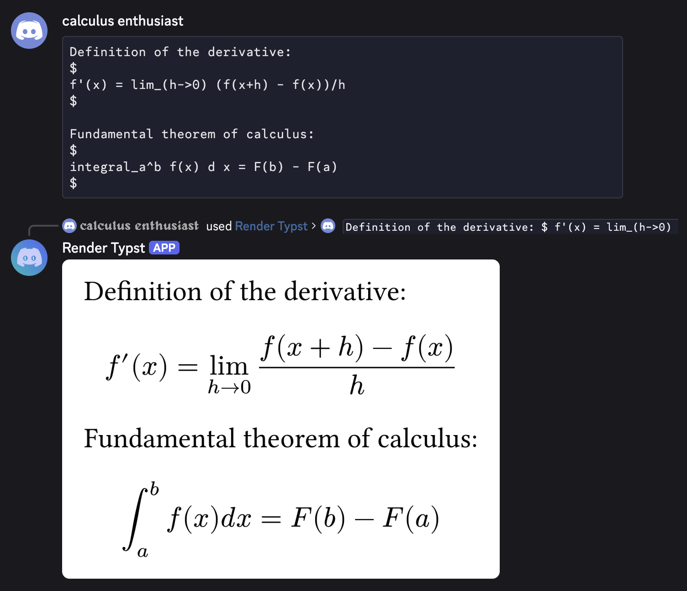

  

# Typst Render (Discord Bot)

A Discord bot that renders [typst](https://typst.app/) markup. [Add it to your account](https://discord.com/oauth2/authorize?client_id=1521969158416236674).

## Usage

The bot registers two commands: a slash command (`/rendertypst`), and a context menu command. The slash command opens a modal for you to type/paste your typst code, while the context menu command (used by right-clicking a message) can render code sent in someone else's message.

## Example

The page is automatically sized to fit your content.

Sandboxing details

The bot renders arbitrary code from non-trusted users, so each compilation job is isolated. To accomplish this, the bot has the following:

- **Separate process per render**
- **Memory cap**: each process is limited to 1GB of memory.
- **Timeout**: compiles are killed after 2 minutes.
- **No filesystem or network**: the Typst engine is built without a file resolver or package resolver. User code can't read local files or import packages.
- **Concurrency limit**: at most 5 renders can run at the same time.

